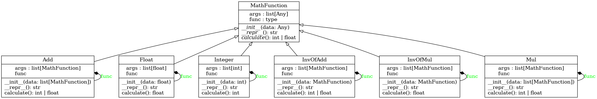

# Math-Parser
Парсер математических выражений

Создать парсер, который будет разбирать и вычислять математические выражения.
Алгоритм должен использовать паттерн "Компоновщик" и уметь вычислять выражения, представление строкой.
Пример: "-1 + (-5) - 4 * 6 * (4 - 3) / (2 - 5 * 4)".
Во входной строке НЕ будут числа с плавающей запятой.

UML-диаграмма:

